# OpenDesk OCM K8s Toolkit PoC

## About this project

This repository contains a Proof of Concept (PoC) implementation of [OpenDesk](https://www.opendesk.eu), a comprehensive digital workplace platform built on cloud-native technologies. The project demonstrates the deployment and management of a complete office suite including collaboration tools, communication platforms, file sharing, and project management applications using modern GitOps practices with [OCM Kubernetes Controller Toolkit](https://github.com/open-component-model/open-component-model/tree/main/kubernetes/controller) and [KRO](https://kro.run/) resource orchestration.

The platform includes core applications such as Nextcloud, Element/Matrix, OpenProject, Collabora, Jitsi, and XWiki, orchestrated through the [Open Component Model (OCM)](https://ocm.software/) and deployed via [Kubernetes Resource Orchestrator (KRO)]((https://kro.run/)) with [FluxCD](https://fluxcd.io/) as the underlying deployment engine.

## 📑 Contents

- [🏗️ Architecture](#️-architecture)
    - [🛠️ Technology Stack](#️-technology-stack)
    - [📊 Architecture Overview](#-architecture-overview)
- [📂 Repository Structure](#-repository-structure)
    - [Key Files](#key-files)
        - [KRO Resource Graph Definition](#kro-resource-graph-definition)
        - [OCM Bootstrap Resources](#ocm-bootstrap-resources)
        - [🔄 Github Workflows](#-github-workflows)
- [📖 Installation Guide](#-installation-guide)
    - [✅ Prerequisites](#-prerequisites)
    - [🏗️ Phase 1: Infrastructure Setup](#️-phase-1-infrastructure-setup)
    - [🚀 Phase 2: Application Deployment](#-phase-2-application-deployment)
- [Monitoring and Troubleshooting](#monitoring-and-troubleshooting)
- [Development](#development)
    - [Makefile Targets](#makefile-targets)
    - [Local Development Workflow](#local-development-workflow)
    - [Testing Different Environments](#testing-different-environments)
    - [Configuration Management with Helmfile](#configuration-management-with-helmfile)
    - [Integration with OCM and KRO](#integration-with-ocm-and-kro)
    - [Automated PR Workflow](#automated-pr-workflow)
- [Support, Feedback, Contributing](#support-feedback-contributing)
- [Security / Disclosure](#security--disclosure)
- [Code of Conduct](#code-of-conduct)
- [Licensing](#licensing)

## 🏗️ Architecture

### 🛠️ Technology Stack
- **[Kubernetes](http://kubernetes.io)**: Container orchestration platform
- **[Open Component Model](http://ocm.software) (OCM)**: Component-based software delivery
- **[ocm-k8s-toolkit](https://github.com/open-component-model/open-component-model/tree/main/kubernetes/controller)**: Open Component Model kubernetes toolkit
- **[KRO](http://kro.run) Resource Graph**: Orchestrate complex Kubernetes resource dependencies
- **[Flux](http://fluxcd.io)**: GitOps toolkit for Kubernetes
- **[Helm](http://helm.sh)**: Kubernetes package manager


### 📊 Architecture Overview

```mermaid

flowchart TB
    subgraph Github["Github"]
        Github_Stack["Repository"]   
        Renovate_Stack["Renovate Bot"]     
        Github_Workflow["Workflow: OCM"]
        Github_Workflow_Helm["Workflow: Helm Values Templating"]
    end

    subgraph Hyperspace["OCI Artifactory"]
        ghcr.io["OCM Repository"]
    end

    subgraph GardenerShoot["SAP Cloud Infrastructure Cluster"]
        subgraph k8sOrchestration["`Deployment Orchestration`"]
            Flux["Flux (GitOps)"]
            ocm-k8s-toolkit["ocm-k8s-toolkit"]
            kro["kro"]
            ExtSecrets["External Secrets"]
            Manifests["k8s manifests"]
        end
        Shoot["openDesk"]
    end

    Github_Stack --> |triggers| Github_Workflow_Helm
    Github_Workflow_Helm --> | triggers| Github_Workflow
    Github_Workflow --> | package & transports | ghcr.io
    ghcr.io --> | fetch Dep. | Renovate_Stack
    Renovate_Stack --> | update Dep. / Versions | Github_Stack
    ghcr.io --> | fetches | Flux
    
    Flux --> |sync| Manifests
    Github_Stack --> |fetch| Flux
    
    Flux --> |deploy| Shoot
    Manifests --> |instructs| ocm-k8s-toolkit
    ocm-k8s-toolkit --> |instructs|kro
    kro --> |instructs| Flux
    ExtSecrets --> |fetch secrets| Vault[(Vault)]
```

<details>
<summary><strong> Detailed Architecture </strong></summary>


</details>

## 📂 Repository Structure

```
├── .github/
│   └── workflows/
│       ├── pr-helmfiles-build.yaml  # Github Workflow generates k8s ConfigMaps which includes templated cluster specific openDesk Helm Values
│       └── ocm-component-check.yml  # Github Workflow for packaging & transporting OCM
├── flux/                   # Flux CD GitOps configurations
├── ocm-k8s-toolkit/        # OCM and KRO bootstrap resources
├── ocm/                    # OCM component artifacts definitions
│   ├── apps/               # openDesk application-specific artifacts
│   ├── k8s-manifests/      # Kro Resource Graph Definition
│   └── values-config-maps/ # Generated ConfigMaps (auto-generated by CI/CD) which includes templated cluster specific openDesk Helm Values
├── opendesk-helmfiles/     # modified Helmfile configurations for all openDesk application components
│   └── helmfile/
├── Makefile               # Build and deployment automation
└── renovate.json          # Dependency management configuration
```

### Key Files

#### KRO Resource Graph Definition 

##### `kro-rgd.yaml`

The `ocm/k8s-manifests/kro-rgd.yaml` file contains the **ResourceGraphDefinition** for KRO (Kubernetes Resource Orchestrator). This is the core orchestration definition that:

1. **Defines the OpenDeskInstance CRD Schema**:
   - Configures deployment parameters (prefix, ~~baseDomain~~, ~~runtime~~)
   - Enables/disables individual OpenDesk components (35+ microservices)
   
> [!NOTE]
> `baseDomain` & `runtime` are not functional!  Flux Helm Chart Values are automatically templated into ConfigMaps during the CI/CD process, because there is no `helmfiles` or `Go Templating` functionality available at deployment time! Changes to Helmfile configurations will trigger automatic ConfigMap regeneration via GitHub Actions.

2. **Orchestrates Resource Dependencies**:
   - **OCM Component Resolution**: Downloads and verifies OpenDesk components from OCM repositories
   - **Flux CD Integration**: Creates OCIRepository, HelmRepository, and Kustomization resources
   - **Application Deployment**: Manages Helm releases for all OpenDesk services
   - **Infrastructure Services**: Provisions ingress-nginx, certificates, databases, and storage

2. **Component Management**:
   The ResourceGraphDefinition manages 35+ OpenDesk components including:
   - **Collaboration**: Nextcloud, Element (Matrix), Jitsi, Cryptpad
   - **Communication**: OpenXchange, Postfix, Dovecot
   - **Development**: XWiki, OpenProject
   - **Infrastructure**: MariaDB, PostgreSQL, Redis, MinIO, Keycloak

3. **Ready State Management**:
   - Defines readiness conditions for each resource
   - Ensures proper deployment sequencing
   - Provides status reporting and health checks

#### OCM Bootstrap Resources

##### `ocm-k8s-toolkit/bootstrap.yaml`
Defines OCM Repository, Component, and initial Resource configurations
##### `ocm-k8s-toolkit/kro-instance.yaml`
Custom `kind:OpenDeskInstance` resource that triggers the deployment via kro RGD.


#### 🔄 Github Workflows

```mermaid
sequenceDiagram
    autonumber
    participant Dev as 👨‍💻 Developer
    participant GH as 🐙 GitHub
    participant GithubWorkflow as ⚙️ Github Workflow
    participant OCM as 📦 OCM
    participant ghcr.io as 🏦 ghcr.io
    Dev->>GH: 📤 Push Code
    GH->>GithubWorkflow: 🚀 Triggers
    GithubWorkflow->>GH: 📦 Create Flux Helm Chart Value ConfigMaps
    GH->>GithubWorkflow: 🚀 Triggers
    GithubWorkflow->>OCM: 📦 Create & Transfers Component
    OCM->>ghcr.io: 🎯 Transfer Artifacts
    ghcr.io-->>Dev: ✅ Build Complete
```



##### `ocm-component-check.yml`
The Github Workflow [`.github/workflows/ocm-component-check.yml`](./.github/workflows/ocm-component-check.yml) is used to find, package and transfer all `./ocm/**/component-constructor.yaml` to an an OCI repository.

#### `pr-helmfiles-build.yaml`

The Github Workflow [`.github/workflows/pr-helmfiles-build.yaml`](./.github/workflows/pr-helmfiles-build.yaml) is used to generates k8s ConfigMaps which includes templated cluster specific Flux Helm Chart Values, because there is no `helmfiles` or `Go Templating` functionality available at deployment time! Changes to Helmfile configurations will trigger automatic ConfigMap regeneration via GitHub Actions.

##### Workflow Triggers
- **Pull Requests**: Automatically runs on PRs targeting the `main` branch
- **Manual Dispatch**: Can be triggered manually via GitHub UI

##### Workflow Steps
1. **Checkout**: Retrieves the PR branch with full git history
2. **Setup Helmfile**: Installs Helmfile tool for configuration management
3. **Build ConfigMaps**: Executes `make all` to generate configurations
4. **Auto-commit**: Commits generated files back to the PR branch
5. **Status Reporting**: Updates PR status with build results

##### Key Features
- **Concurrency Control**: Prevents multiple builds on the same PR
- **Auto-commit**: Generated ConfigMaps are automatically committed to PRs
- **Status Integration**: Build status is reported back to GitHub

## 📖 Installation Guide

### ✅ Prerequisites

1. **local tooling**: [OCM CLI tools](https://ocm.software/docs/getting-started/installation/) & [kubectl](https://kubernetes.io/de/docs/reference/kubectl/) installed
2. **OCI Artifactory**: ghcr.io or other OCI-compliant registry for OCM components
3. **Network Infrastructure**: Cluster with Internet access and Internet-facing domain
6. **Load Balancer**: Internet-facing ingress controller
7. **DNS Management**: Wildcard certificate support

### 🏗️ Phase 1: Infrastructure Setup

#### Workload Cluster `Deployment Orchestration`
Install the following k8s software:
- [flux](http://fluxcd.io)
- [kro.run](http://kro.run)
- [ocm-k8s-toolkit](https://github.com/open-component-model/open-component-model/tree/main/kubernetes/controller)

#### Certificate Management

Create [required TLS certificate](https://gitlab.opencode.de/bmi/opendesk/deployment/opendesk/-/blob/develop/docs/getting-started.md#dns) secret (see your ingress controller documentation).

#### 🔐 Security & Credential Management

Implement security best practices to protect sensitive information and credentials.

<a id="required-kubernetes-secrets"></a>
#### Required Kubernetes Secrets

The following **Kubernetes secrets** must be present on your `Workload Cluster`:

| Secret Name              | Documentation                                                                                                                         | Purpose                                                                      |
| ------------------------ | ------------------------------------------------------------------------------------------------------------------------------------- | ---------------------------------------------------------------------------- |
| **`github-pull-secret`** | [GitHub Access Token](https://docs.github.com/en/authentication/keeping-your-account-and-data-secure/managing-your-personal-access-tokens)  | Access private Github repository access                                      |
| **`ocm-secret`**         | [ghcr.io Identity Token](https://docs.github.com/en/authentication/keeping-your-account-and-data-secure/managing-your-personal-access-tokens) | Credentials to access ghcr.io OCI-compliant registry for OCM components |

### 🚀 Phase 2: Application Deployment

#### 📋 Deployment Sequence

The Kro Resource Graph Definitions defines a specific deployment order ([`ocm/k8s-manifests/kro-rgd.yaml`](./ocm/k8s-manifests/kro-rgd.yaml)):

```mermaid
graph TD
    subgraph "Deployment Flow"
        A[Start Deployment] --> B[🏗️ Infrastructure Layer]
        B --> C[💾 Data Layer]
        C --> D[🔧 Platform Services]
        D --> E[📱 Application Layer]
        E --> F[✅ Deployment Complete]
    end
    
    subgraph "Infrastructure Layer"
        B1[nginx-ingress<br/>Ingress Controller]
        B2[cert-manager<br/>Certificate Manager]
        B3[Otterize<br/>Network Policies]
    end
    
    subgraph "Data Layer"
        C1[PostgreSQL<br/>Primary Database]
        C2[MariaDB<br/>Secondary Database]
        C3[Redis<br/>Caching]
        C4[MinIO<br/>Object Storage]
    end
    
    subgraph "Platform Services"
        D1[Nubus/UCS<br/>Identity Management]
        D2[Keycloak<br/>Authentication]
        D3[Intercom Service<br/>Communication]
    end
    
    subgraph "Application Layer"
        E1[Nextcloud<br/>File Sharing]
        E2[Element/Matrix<br/>Messaging]
        E3[OpenProject<br/>Project Management]
        E4[Collabora<br/>Office Suite]
        E5[Jitsi<br/>Video Conferencing]
        E6[XWiki<br/>Knowledge Management]
    end
    
    B --> B1
    B --> B2
    B --> B3
    
    C --> C1
    C --> C2
    C --> C3
    C --> C4
    
    D --> D1
    D --> D2
    D --> D3
    
    E --> E1
    E --> E2
    E --> E3
    E --> E4
    E --> E5
    E --> E6
    
    B1 -.-> C1
    B2 -.-> C1
    B3 -.-> C1
    
    C1 -.-> D1
    C2 -.-> D1
    C3 -.-> D1
    C4 -.-> D1
    
    D1 -.-> E1
    D2 -.-> E1
    D3 -.-> E1
    
```



<details>
<summary><strong>Layer and Service items:</strong></summary>

1. **🏗️ Infrastructure Layer**
   - Ingress Controller (nginx-ingress)
   - Certificate Manager (cert-manager)
   - Network Policies (Otterize)

2. **💾 Data Layer**
   - PostgreSQL (primary database)
   - MariaDB (secondary database)
   - Redis (caching)
   - MinIO (object storage)

3. **🔧 Platform Services**
   - Nubus/UCS (identity management)
   - Keycloak (authentication)
   - Intercom Service (communication)

4. **📱 Application Layer**
   - Nextcloud (file sharing)
   - Element/Matrix (messaging)
   - OpenProject (project management)
   - Collabora (office suite)
   - Jitsi (video conferencing)
   - XWiki (knowledge management)

</details>

### Bootstrap OpenDesk Deployment
We are going to bootstrap `ocm-k8s-toolkit` via Flux GitOps.

```bash
kubectl apply -f flux/*
````

```mermaid
sequenceDiagram
    autonumber
    participant Flux as ⚙️ Flux
    participant OCM as 📦 OCM-k8s-toolkit
    participant kro as ⚙️ kro
    
    Flux->>OCM: 🎯 Bootstrapping
    create participant ghcr.io as 🏦 ghcr.io
    OCM->>ghcr.io: 📦 Fetches OCM Component Version & Resources
    
    OCM->>kro: 🚀 Applies kro RGD for kind: OpenDeskInstance
    Flux->>kro: 🚀 Applies kro Instance of kind: OpenDeskInstance
    kro->>OCM: Creates k8s "delivery.ocm.software" resources (see ocm/k8s-manifests/kro-rgd.yaml)
    kro->>Flux: Creates k8s "source.toolkit.fluxcd.io" (see ocm/k8s-manifests/kro-rgd.yaml)
    create participant OpenDesk as 👨‍💻 OpenDesk

    Flux->>OpenDesk: Installs openDesk Helm Charts
```



## Monitoring and Troubleshooting

- **Resource Status**: `kubectl get opendeskinstance,resourcegraphdefinition -A`
- **Component Health**: `kubectl get helmrelease,kustomization -A`
- **OCM Resources**: `kubectl get repository,component,resource -A`
- **Application Logs**: Access via individual service endpoints

## Development

### Makefile Targets

The project provides several Makefile targets for development and CI/CD:

#### OCM Management
```bash
# Print registry information
make print-registry

# Print OCM version
make print-ocm-version
```

#### Configuration Management
```bash
# Generate Helmfile values for all applications
make values DOMAIN="dev.example.com" ENV=dev NAMESPACE=default

# Package values into Kubernetes ConfigMaps
make configmaps

# Complete build process (values + configmaps)
make all

# Clean temporary files
make clean
```

#### Environment Variables
- `DOMAIN`: Target domain for the deployment (default: "opendesk.example.com")
- `ENV`: Environment name (default: dev)
- `NAMESPACE`: Kubernetes namespace (default: default)
- `REGISTRY`: OCM registry URL (default: ghcr.io/platform-mesh/samples-opendesk-ocm-k8s-toolkit)

### Local Development Workflow

1. **Modify Configurations**: Edit Helmfile configurations in `opendesk-helmfiles/helmfile/apps/`
2. **Generate ConfigMaps**: Run `make all` to generate updated ConfigMaps
3. **Test Changes**: Review generated ConfigMaps in `ocm/values-config-maps/`
4. **Submit PR**: GitHub Actions will automatically regenerate and commit ConfigMaps

### Testing Different Environments

```bash
# Development environment
DOMAIN="dev.example.com" ENV=dev make all

# Staging environment  
DOMAIN="staging.example.com" ENV=staging make all

# Production environment
DOMAIN="prod.example.com" ENV=production make all
```

### Configuration Management with Helmfile

The project uses Helmfile to manage complex Helm chart configurations across multiple OpenDesk components.

#### Configuration Generation Process

The Makefile provides several targets for configuration management:

##### 1. Generate Values Files
```bash
make values DOMAIN="your-domain.com" ENV=dev NAMESPACE=default
```
This command:
- Processes Helmfile configurations for each application
- Generates environment-specific `values.yaml` files
- Places output in `{app}/out/{release-name}.yaml`

##### 2. Package into ConfigMaps
```bash
make configmaps
```
This command:
- Converts each values file into a Kubernetes ConfigMap
- Names ConfigMaps using pattern: `{app}-{release}-config-map.yaml`
- Stores ConfigMaps in `ocm/values-config-maps/`

##### 3. Complete Build Process
```bash
make all
```
Executes both `values` and `configmaps` targets in sequence.

##### 4. Cleanup
```bash
make clean
```
Removes temporary `out/` directories from all app folders.

#### ConfigMap Structure

Generated ConfigMaps follow this structure:
```yaml
apiVersion: v1
kind: ConfigMap
metadata:
  name: {app}-{component}-config-map
data:
  values.yaml: |
    # Helm values configuration
    component:
      configuration:
        # Application-specific settings
```

**Example**: `nextcloud-opendesk-nextcloud-config-map.yaml`
```yaml
apiVersion: v1
kind: ConfigMap
metadata:
  name: nextcloud-opendesk-nextcloud-config-map
data:
  values.yaml: |
    aio:
      configuration:
        database:
          host: postgresql
          name: nextcloud
          type: pgsql
        cache:
          host: redis-headless
          port: "6379"
```

### Integration with OCM and KRO

The generated ConfigMaps are consumed by the KRO ResourceGraphDefinition (`kro-rgd.yaml`) through OCM components:

1. **OCM Packaging**: ConfigMaps are packaged as OCM resources and stored in the container registry
2. **KRO Orchestration**: The ResourceGraphDefinition references these ConfigMaps as OCI artifacts
3. **Flux Deployment**: Flux CD downloads and applies the configurations during deployment

#### OCM Component Flow


### Local Development

For local development and testing:

```bash
# Generate configurations for a specific domain
DOMAIN="dev.example.com" make all

# Test with different environments
ENV=staging DOMAIN="staging.example.com" make all

# Clean up generated files
make clean
```

### Automated PR Workflow

When submitting a pull request:

1. **Create PR**: Submit changes to Helmfile configurations
2. **Auto-build**: GitHub Actions automatically runs `make all`
3. **Auto-commit**: Generated ConfigMaps are committed to the PR
4. **Review**: Review both configuration changes and generated ConfigMaps
5. **Merge**: ConfigMaps are automatically included in the merge

> [!TIP]
> Always review the generated ConfigMaps in your PR to ensure configurations are correct before merging.
## Support, Feedback, Contributing

This project is open to feature requests/suggestions, bug reports etc. via [GitHub issues](https://github.com/platform-mesh/samples-opendesk-ocm-k8s-toolkit/issues). Contribution and feedback are encouraged and always welcome. For more information about how to contribute, the project structure, as well as additional contribution information, see our [Contribution Guidelines](CONTRIBUTING.md).

## Security / Disclosure
If you find any bug that may be a security problem, please follow our instructions at [in our security policy](https://github.com/platform-mesh/samples-opendesk-ocm-k8s-toolkit/security/policy) on how to report it. Please do not create GitHub issues for security-related doubts or problems.

## Code of Conduct

We as members, contributors, and leaders pledge to make participation in our community a harassment-free experience for everyone. By participating in this project, you agree to abide by its [Code of Conduct](https://github.com/platform-mesh/.github/blob/main/CODE_OF_CONDUCT.md) at all times.

## Licensing

Copyright (20xx-)20xx SAP SE or an SAP affiliate company and samples-opendesk-ocm-k8s-toolkit contributors. Please see our [LICENSE](LICENSE) for copyright and license information. Detailed information including third-party components and their licensing/copyright information is available [via the REUSE tool](https://api.reuse.software/info/github.com/platform-mesh/samples-opendesk-ocm-k8s-toolkit).
